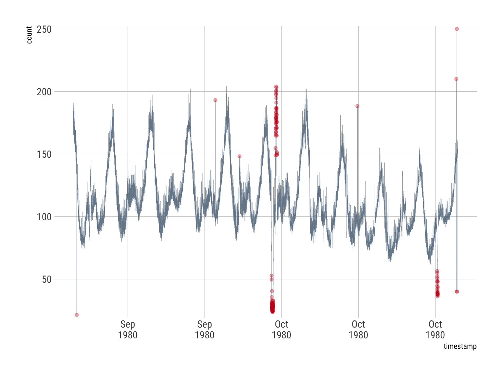
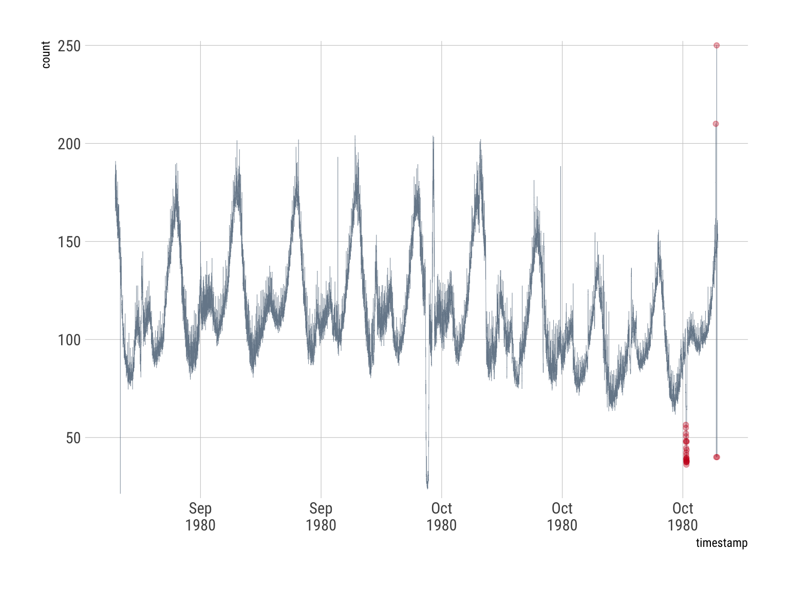

[](https://travis-ci.org/hrbrmstr/AnomalyDetection)

<!-- README.md is generated from README.Rmd. Please edit that file -->

# AnomalyDetection

Anomaly Detection Using Seasonal Hybrid Extreme Studentized Deviate Test

## Description

A technique for detecting anomalies in seasonal univariate time series.
The methods uses are robust, from a statistical standpoint, in the
presence of seasonality and an underlying trend. These methods can be
used in wide variety of contexts. For example, detecting anomalies in
system metrics after a new software release, user engagement post an
‘A/B’ test, or for problems in econometrics, financial engineering,
political and social sciences.

## About This Fork

Twitterfolks launched this package in 2014. Many coding and package
standards have changed. The package now conforms to CRAN standards.

The plots were nice and all but terribly unnecessary. The two core
functions have been modified to only return tidy data frames (tibbles,
actually). This makes it easier to chain them without having to deal
with list element dereferencing.

Shorter, snake-case aliases have also been provided:

  - `ad_ts` for `AnomalyDetectionTs`
  - `ad_vec` for `AnomalyDetectionVec`

The original names are still in the package but the `README` and
examples all use the newer, shorter versions.

The following outstanding PRs from the original repo are included:

  - Added in PR
    [\#98](https://github.com/twitter/AnomalyDetection/pull/98/)
    (@gggodhwani)
  - Added in PR
    [\#93](%3Chttps://github.com/twitter/AnomalyDetection/pull/93)
    (@nujnimka)
  - Added in PR
    [\#69](%3Chttps://github.com/twitter/AnomalyDetection/pull/69)
    (@randakar)
  - Added in PR
    [\#44](%3Chttps://github.com/twitter/AnomalyDetection/pull/44)
    (@nicolasmiller)
  - PR [\#92](https://github.com/twitter/AnomalyDetection/pull/92)
    (@caijun) inherently resolved

If those authors find this repo, please add yourselves to the
`DESCRIPTION` as contirbutors.

## What’s Inside The Tin

The following functions are implemented:

  - `ad_ts`: Anomaly Detection Using Seasonal Hybrid ESD Test
  - `ad_vec`: Anomaly Detection Using Seasonal Hybrid ESD Test

## How the package works

The underlying algorithm – referred to as Seasonal Hybrid ESD (S-H-ESD)
builds upon the Generalized ESD test for detecting anomalies. Note that
S-H-ESD can be used to detect both global as well as local anomalies.
This is achieved by employing time series decomposition and using robust
statistical metrics, viz., median together with ESD. In addition, for
long time series (say, 6 months of minutely data), the algorithm employs
piecewise approximation - this is rooted to the fact that trend
extraction in the presence of anomalies in non-trivial - for anomaly
detection.

Besides time series, the package can also be used to detect anomalies in
a vector of numerical values. We have found this very useful as many
times the corresponding timestamps are not available. The package
provides rich visualization support. The user can specify the direction
of anomalies, the window of interest (such as last day, last hour),
enable/disable piecewise approximation; additionally, the x- and y-axis
are annotated in a way to assist visual data analysis.

## Installation

You can install AnomalyDetection from github with:

``` r
# install.packages("devtools")
devtools::install_github("hrbrmstr/AnomalyDetection")
```

## How to get started

``` r
library(AnomalyDetection)
library(hrbrthemes)
library(tidyverse)
```

``` r
data(raw_data)

res <- ad_ts(raw_data, max_anoms=0.02, direction='both')

glimpse(res)
## Observations: 131
## Variables: 2
## $ timestamp <dttm> 1980-09-25 16:05:00, 1980-09-29 06:40:00, 1980-09-29 21:44:00, 1980-09-30 17:46:00, 1980-09-30 1...
## $ anoms     <dbl> 21.3510, 193.1036, 148.1740, 52.7478, 49.6582, 35.6067, 32.5045, 30.0555, 31.2614, 30.2551, 27.38...

# for ggplot2
raw_data$timestamp <- as.POSIXct(raw_data$timestamp)

ggplot() +
  geom_line(
    data=raw_data, aes(timestamp, count), 
    size=0.125, color="lightslategray"
  )  +
  geom_point(
    data=res, aes(timestamp, anoms), color="#cb181d", alpha=1/3
  ) +
  scale_x_datetime(date_labels="%b\n%Y") +
  scale_y_comma() +
  theme_ipsum_rc(grid="XY")
```



From the plot, we observe that the input time series experiences both
positive and negative anomalies. Furthermore, many of the anomalies in
the time series are local anomalies within the bounds of the time
series’ seasonality (hence, cannot be detected using the traditional
approaches). The anomalies detected using the proposed technique are
annotated on the plot. In case the timestamps for the plot above were
not available, anomaly detection could then carried out using the
AnomalyDetectionVec function; specifically, one can use the
`AnomalyDetectionVec()` method. The equivalent call to the above would
be:

``` r
ad_vec(raw_data[,2], max_anoms=0.02, period=1440, direction='both')
```

Often, anomaly detection is carried out on a periodic basis. For
instance, at times, one may be interested in determining whether there
was any anomaly yesterday. To this end, we support a flag only\_last
whereby one can subset the anomalies that occurred during the last day
or last hour.

``` r
data(raw_data)

res <- ad_ts(raw_data, max_anoms=0.02, direction='both', only_last="day")

glimpse(res)
## Observations: 25
## Variables: 2
## $ timestamp <dttm> 1980-10-05 01:12:00, 1980-10-05 01:13:00, 1980-10-05 01:14:00, 1980-10-05 01:15:00, 1980-10-05 0...
## $ anoms     <dbl> 56.4691, 54.9415, 52.0359, 47.7313, 50.5876, 48.2846, 44.6438, 42.3077, 38.8363, 41.0145, 39.5523...

# for ggplot2
raw_data$timestamp <- as.POSIXct(raw_data$timestamp)

ggplot() +
  geom_line(
    data=raw_data, aes(timestamp, count), 
    size=0.125, color="lightslategray"
  )  +
  geom_point(
    data=res, aes(timestamp, anoms), color="#cb181d", alpha=1/3
  ) +
  scale_x_datetime(date_labels="%b\n%Y") +
  scale_y_comma() +
  theme_ipsum_rc(grid="XY")
```



Anomaly detection for long duration time series can be carried out by
setting the longterm argument to `TRUE`.

## Copyright & License

Copyright © 2015 Twitter, Inc. and other contributors

Licensed under the GPLv3

## Code of Conduct

Please note that this project is released with a [Contributor Code of
Conduct](CONDUCT.md). By participating in this project you agree to
abide by its terms.
